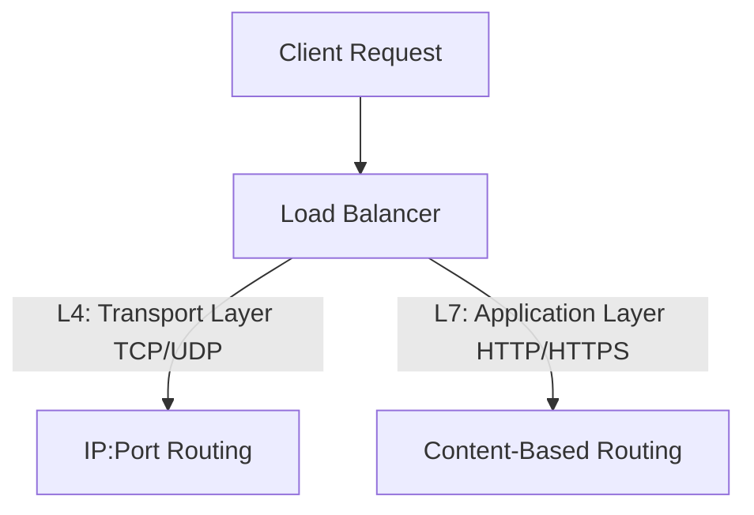
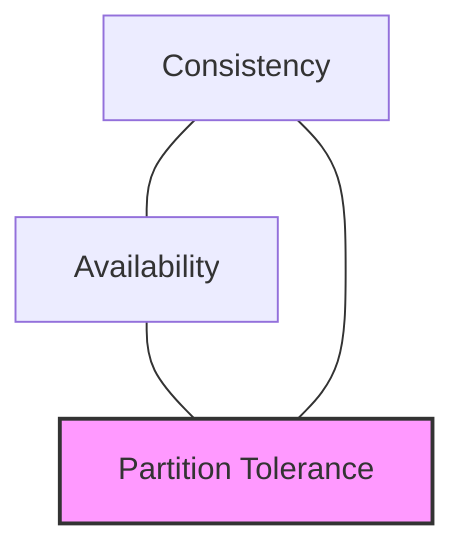

# System Design: Architecture, Distributed Systems, and Reference Manual

This document serves as a comprehensive reference guide for system design, distributed systems architecture, scaling paradigms, and reliability engineering.

---

## 1. Core System Design Fundamentals

Building modern, distributed software systems requires balancing multiple competing requirements. Before diving into architectural components, we must understand the fundamental metrics and trade-offs that govern system behavior.

### 1.1 Scalability
Scalability is the measure of a system's ability to handle growing amounts of work or its potential to be enlarged to accommodate that growth.

*   **Vertical Scaling (Scaling Up)**: Adding resources (CPU, RAM, Storage) to a single server node.
    *   *Pros*: Simple to implement; no changes to application architecture; zero network latency between components.
    *   *Cons*: Hard hardware limits; single point of failure (SPOF); exponential costs as server capacities reach premium limits.
*   **Horizontal Scaling (Scaling Out)**: Adding more machine nodes to the system pool.
    *   *Pros*: Virtually limitless scaling capability; built-in redundancy and high availability.
    *   *Cons*: Requires a load balancer; introduces network latency and synchronization issues; requires applications to be stateless.

### 1.2 Latency vs. Throughput
*   **Latency**: The time taken for a single unit of work to be processed and return a result (often measured in milliseconds).
*   **Throughput**: The number of units of work processed by the system within a given time interval (e.g., requests per second (RPS), queries per second (QPS), or data transfer rate).
*   *Key Relationship*: Lowering latency often helps increase throughput, but a system optimized for high throughput may sacrifice latency by processing requests in batches to reduce overhead.

### 1.3 Availability and SLAs
Availability is the percentage of time a system remains operational and accessible to perform its required functions. It is typically expressed in "nines":

| Availability | Downtime per Year | Downtime per Month |
| :--- | :--- | :--- |
| **99% (Two Nines)** | 3.65 days | 7.31 hours |
| **99.9% (Three Nines)** | 8.77 hours | 43.83 minutes |
| **99.99% (Four Nines)** | 52.56 minutes | 4.38 minutes |
| **99.999% (Five Nines)** | 5.26 minutes | 26.30 seconds |

*   **Service Level Agreement (SLA)**: A formal contract between a service provider and client specifying the guaranteed level of service (e.g., 99.9% availability) and penalties for failure.
*   **Service Level Objective (SLO)**: An internal target for service performance (e.g., latency < 200ms for 99% of requests).
*   **Service Level Indicator (SLI)**: A real-time metric measuring compliance with an SLO (e.g., actual request latency).

### 1.4 Reliability and Fault Tolerance
*   **Reliability**: The probability that a system performs its intended function without failure under specified conditions for a specified period.
*   **Fault Tolerance**: A system design characteristic that enables it to continue operating properly in the event of the failure of one or more of its components.
*   *Mechanism*: Realized through redundancy, graceful degradation, and eliminating Single Points of Failure (SPOF).

---

## 2. Load Balancing

Load balancers distribute incoming network traffic across multiple backend servers to prevent overload, optimize utilization, and ensure high availability.

### 2.1 Layer 4 (L4) vs. Layer 7 (L7) Load Balancing
Load balancers operate at different layers of the OSI model:

*   **Layer 4 Load Balancing**:
    *   Operates at the Transport layer (TCP/UDP).
    *   Routes traffic based on IP address and port numbers without inspecting the packet payload.
    *   *Characteristics*: Fast, low CPU overhead, protocol agnostic, unable to perform smart routing based on request parameters (like cookies or HTTP headers).
*   **Layer 7 Load Balancing**:
    *   Operates at the Application layer (HTTP/HTTPS/gRPC).
    *   Inspects packet payloads to make routing decisions based on cookies, HTTP headers, URLs, or query parameters.
    *   *Characteristics*: Higher CPU overhead due to SSL termination and header parsing; enables features like session stickiness, path-based routing (e.g., `/api` vs `/static`), and web application firewalls (WAF).

### 2.2 Load Balancing Algorithms
1.  **Round Robin**: Sequentially routes requests to each server in the pool. Best when servers have identical capacity.
2.  **Weighted Round Robin**: Assigns a weight to each server based on capacity; higher-weighted servers receive proportionately more requests.
3.  **Least Connections**: Routes requests to the server with the fewest active connections. Ideal for long-lived transactions.
4.  **IP Hash**: Hashes the client's IP address to select a server. Useful for basic session persistence.
5.  **Consistent Hashing**: A hashing scheme where servers and keys are mapped onto a circular ring.
    *   *Core Benefit*: Minimizes key relocation when servers are added or removed (only $K/N$ keys need to be remapped, where $K$ is the number of keys and $N$ is the number of servers).

---

## 3. Database Scaling and Distributed Storage

As application demand grows, the database often becomes the primary system bottleneck. Scaling storage requires choosing the right paradigms and partitioning schemas.

### 3.1 SQL vs. NoSQL
Distributed systems require selecting databases that match query patterns and consistency requirements:

| Dimension | Relational (SQL) | Non-Relational (NoSQL) |
| :--- | :--- | :--- |
| **Schema** | Rigid, predefined tabular schemas. | Flexible (Document, Key-Value, Columnar, Graph). |
| **Scaling** | Typically vertical (can scale horizontally via read replicas/sharding). | Built to scale horizontally across commodity clusters. |
| **Transactions** | Strong ACID guarantees. | BASE properties (Eventual consistency prioritized). |
| **Examples** | PostgreSQL, MySQL, Oracle. | MongoDB, Cassandra, Redis, Neo4j. |

### 3.2 ACID vs. BASE
*   **ACID (Traditional SQL)**:
    *   **Atomicity**: All operations in a transaction succeed or all fail.
    *   **Consistency**: A transaction takes the database from one valid state to another.
    *   **Isolation**: Concurrent execution of transactions leaves the database in the same state as if they executed sequentially.
    *   **Durability**: Committed data survives system crashes.
*   **BASE (Modern NoSQL)**:
    *   **Basically Available**: The system is guaranteed to respond, but responses may fail or contain stale data.
    *   **Soft State**: The state of the system can change over time without explicit write operations due to propagation lag.
    *   **Eventual Consistency**: Data converges to a consistent state across all nodes given enough time without new updates.

### 3.3 CAP Theorem
In a distributed data store, you can guarantee at most two of the following three properties simultaneously:

1.  **Consistency (C)**: Every read receives the most recent write or an error.
2.  **Availability (A)**: Every non-failing node returns a non-error response (without guarantee that it contains the most recent write).
3.  **Partition Tolerance (P)**: The system continues to operate despite arbitrary message loss or network partitions.
*   *Real-world trade-off*: In a network partition, you must choose between **CP** (cancel the operation to ensure consistency, sacrificing availability) and **AP** (proceed with the operation using local data, sacrificing consistency).

### 3.4 Scaling Storage: Replication, Partitioning, and Sharding
*   **Replication**: Copying data across multiple database nodes.
    *   *Single-Leader (Master-Slave)*: All writes go to the leader; reads can be served by followers. Good for read-heavy workloads. Introduces replication lag.
    *   *Multi-Leader (Master-Master)*: Multiple nodes accept writes. Requires complex conflict resolution.
    *   *Leaderless*: Clients write to and read from multiple nodes (e.g., Cassandra). Relies on quorums ($W + R > N$) to ensure consistency.
*   **Partitioning**: Dividing a large database into smaller, independent parts (partitions) within the same node to optimize query processing.
*   **Sharding**: Distributing database partitions across separate physical server nodes.
    *   *Horizontal Partitioning*: Storing different rows of the same table on different database servers.
    *   *Sharding Strategies*:
        *   **Range-Based**: Sharding based on a range of values (e.g., IDs 1–10,000 go to Shard A). Can cause hot-spotting.
        *   **Hash-Based**: Applying a hash function to a shard key to determine the target shard. Distributes data evenly but makes range queries expensive.
        *   **Directory-Based**: Using a lookup service to track which shard holds specific records. Introduces an extra network hop.

### 3.5 Storage Engines: B-Trees vs. LSM Trees
Storage engines manage how data is structured on disk:
*   **B-Trees**:
    *   Organize data into fixed-size pages (usually 4KB) structured as a balanced search tree.
    *   *Characteristics*: Fast random reads ($O(\log N)$); slower writes because updates modify pages in place, requiring disk head movement and write amplification.
*   **LSM Trees (Log-Structured Merge-Trees)**:
    *   Appends writes sequentially to an in-memory buffer (MemTable) and a sequential log on disk (Commit Log). When the MemTable fills up, it is flushed to disk as an immutable Sorted String Table (SSTable).
    *   *Characteristics*: High write throughput (since writes are sequential appends); reads are slower because they may need to search multiple SSTables, mitigated by Bloom Filters and Compaction.

---

## 4. Caching and Content Delivery

Caching stores frequently accessed data in high-speed, temporary memory (RAM) to serve requests faster and reduce the load on databases and backend application servers.

### 4.1 Caching Patterns
1.  **Cache-Aside (Lazy Loading)**:
    *   The application queries the cache first. If a cache miss occurs, it queries the database, writes the result to the cache, and returns it.
    *   *Pros*: Resilient to cache failures; cache only contains requested data.
    *   *Cons*: First request is slow (cache miss); data inconsistency can occur if the database is updated directly.
2.  **Read-Through**:
    *   The application treats the cache as the main data store. On a cache miss, the cache library/middleware reads from the database and updates itself transparently.
    *   *Pros*: Separates caching logic from application code.
    *   *Cons*: Requires a library/database driver supporting this integration.
3.  **Write-Through**:
    *   Writes go directly to the cache first, and the cache writes immediately to the database before confirming success.
    *   *Pros*: High data consistency; reads never experience cache misses for newly written data.
    *   *Cons*: High write latency (writes require two network hops).
4.  **Write-Behind (Write-Back)**:
    *   Writes update the cache first and immediately return success. The cache asynchronously batches updates and writes them to the database later.
    *   *Pros*: High write throughput; reduces direct database write pressure.
    *   *Cons*: Risk of data loss if the cache server crashes before data is persisted to disk.

### 4.2 Cache Eviction Policies
When the cache reaches memory limits, old or unused keys must be removed:
*   **LRU (Least Recently Used)**: Discards the least recently accessed items first.
*   **LFU (Least Frequently Used)**: Discards items with the lowest access frequency.
*   **FIFO (First In, First Out)**: Discards items in the order they were inserted.
*   **TTL (Time To Live)**: Automatically invalidates cache items after a set time duration.

### 4.3 Content Delivery Networks (CDNs)
A CDN is a geographically distributed network of proxy servers (Edge Nodes) designed to deliver content (images, video, JS, CSS, and dynamic APIs) to users from the closest physical location.
*   **Static Caching**: Edge servers store static files cached from the origin server based on cache-control headers.
*   **Dynamic Acceleration**: Minimizes round-trip times for API endpoints by optimizing network routing paths and TCP handshakes from the edge to the origin server.
